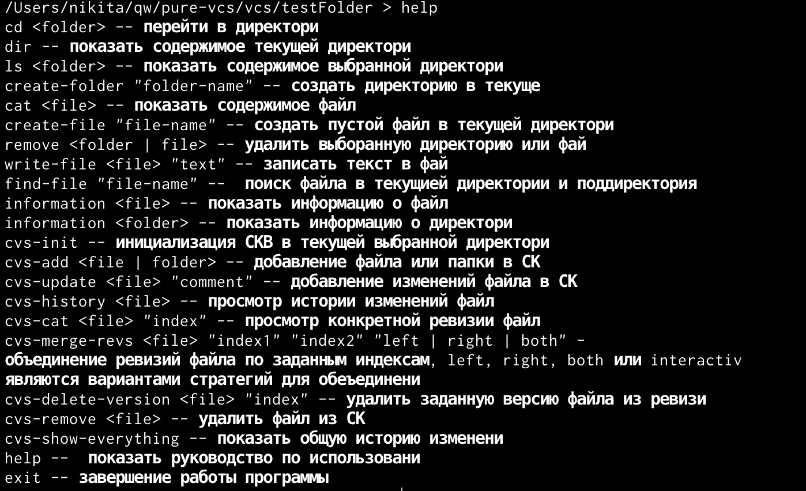

# Quickstart
[](https://github.com/niki999922/pure-vcs/blob/master/LICENSE)

This program allow you work with your file system "pure" without fear of lost state system, because of i't work like offline and in the end write result.

Program providing offline work with the file system with support for local version control. To do this, transfer the start directory from which the local file system will be initialized

## Run program: 
```shell script
stack exec vcs -- <absolute path>
```
Example:
```shell script
stack exec vcs -- "/Users/name/this/repository/path/vcs/testFolder/Root"
```

## Run Tests
```shell script
stack test
```


